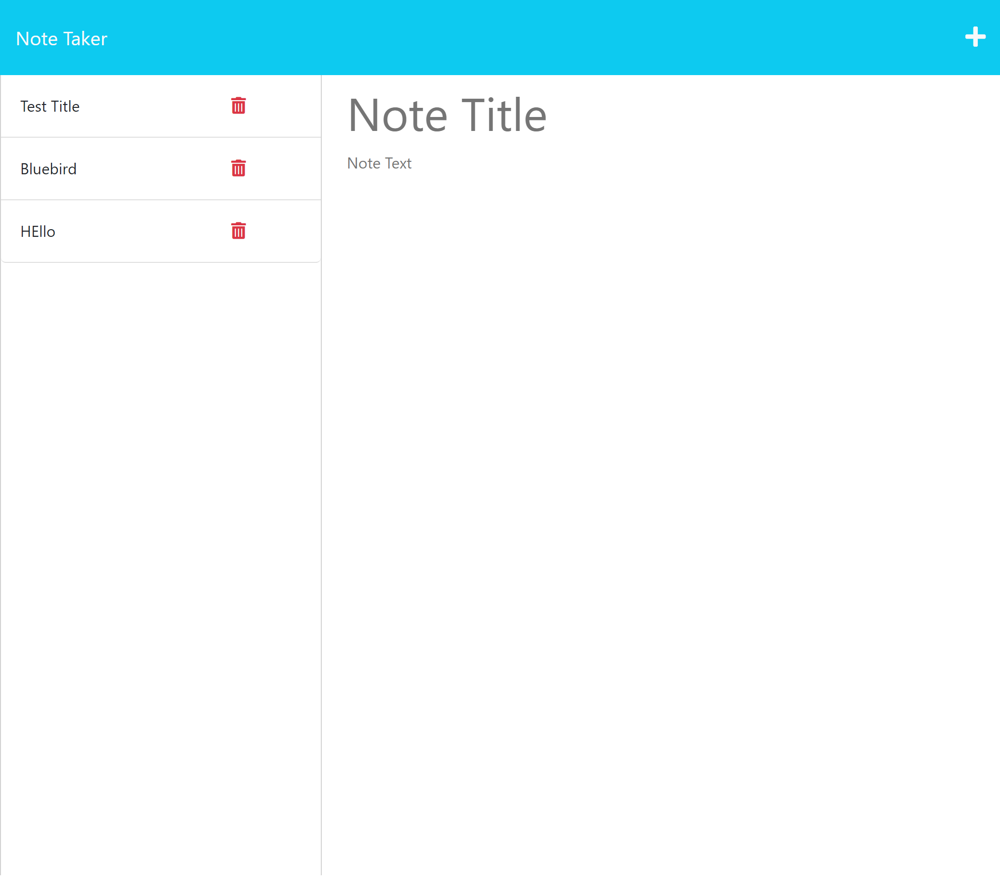

# Notetaker Application  

### <u> Description: </u>
This application allows the user to take notes with titles and have them saved. 

### <u> Notes: </u>
- paths/routes were created to link the Front and Backend.
- Test have been run on terminal and Insomnia and are satisfactory.

### <u> Screenshot: </u>
.png)

  

    
### <u> Deployable Link to Website: </u>

https://peaceful-peak-50724.herokuapp.com

### <u> Support:  </u>

- [MDN](https://developer.mozilla.org/en-US/) 

- [Google](https://Google.com)

### <u> Contact: </u>

- [Contact - Future Coder - Joseph S. Ortega](mailto:MyAgentOrtega@gmail.com)

### <u> Acknowledgement </u>

Authors and acknowledgement: Thank you to all my peers, tutors and instructors that helped me along the way!

### <u> License </u>

